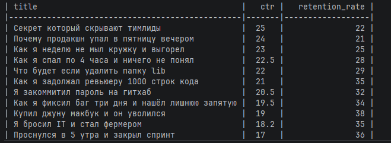

# YouTube Reports

## Доступные отчёты

### `clickbait`

Отчёт показывает кликбейтные видео — видео, у которых одновременно:

- `ctr > 15`
- `retention_rate < 40`

В отчёте выводятся колонки:

- `title`
- `ctr`
- `retention_rate`

Результат сортируется по убыванию `ctr`.

## Пример запуска

```bash
cd youtube_reports
python main.py --files stats1.csv stats2.csv --report clickbait

или

python youtube_reports/main.py --files stats1.csv stats2.csv --report clickbait
```
## Пример вывода



## Тесты

# Запуск
```bash
python pytest -m pytest -v
```

# Пример работы тестов
